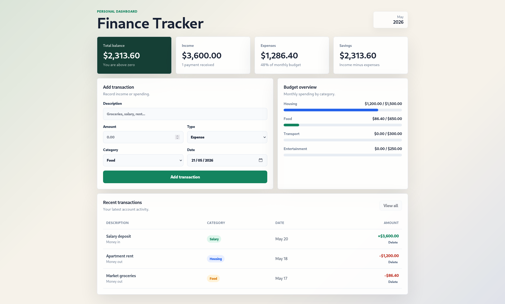

# Finance Tracker Practice Project

Finance Tracker is a simple personal finance dashboard for tracking income, expenses, category budgets, and recent transactions practice project. The goal is to recreate the app from requirements, not by copying the finished implementation.

## Screenshots

## Repository Structure

- `reference-app/`: finished reference implementation.
- `obsidian/`: Obsidian notes, build guide, Kanban board, and task cards.
- `assets/`: screenshots and other repo assets.

## View The Reference App

Open `reference-app/index.html` in a browser.

No build step is required. The reference app uses plain HTML, CSS, and JavaScript.

## What Learners Build

The project covers:

- A responsive finance dashboard layout.
- Summary cards for balance, income, expenses, and savings.
- A transaction form with conditional category options.
- Dynamic transaction rendering.
- Budget progress indicators by category.
- Delete and view-all controls.
- Local browser persistence with `localStorage`.

## Use The Obsidian Notes

The `obsidian/` folder can be used in two ways:

1. Open `obsidian/` directly as an Obsidian vault.
2. Copy `obsidian/` into your existing Obsidian vault and optionally rename it to `Finance Tracker Project`.

If you use the Kanban board, install Obsidian's Kanban plugin and open `BUILD_KANBAN.md`.

Obsidian is optional. The notes are plain Markdown, so you can also read them directly on GitHub or in any Markdown editor.

## Without Obsidian

You can still use the project without Obsidian:

1. Read `obsidian/Finance Tracker Project.md`.
2. Follow `obsidian/BUILD_GUIDE.md`.
3. Use the checklist files in `obsidian/Cards/` as plain Markdown tasks.
4. Track progress manually in GitHub issues, a project board, or your own checklist.

## Start Here

Inside Obsidian, start with:

- `Finance Tracker Project.md`: project overview, scope, decisions, and workflow.
- `BUILD_KANBAN.md`: Kanban board for tracking progress.
- `BUILD_GUIDE.md`: full feature roadmap and build guide.
- `Cards/`: detailed checklist notes linked from the Kanban board.

## Suggested Workflow

1. Read `Finance Tracker Project.md`.
2. Open `BUILD_KANBAN.md` in Obsidian's Kanban plugin.
3. Move one card into `In Progress`.
4. Open the linked card note.
5. Build and manually test that feature.
6. Move the card to `Done` when its checklist passes.

## AI Assistance

This repo was created with AI assistance using Codex. The reference app, build guide, Kanban board, and Obsidian notes were developed iteratively as a learning/practice project.

The goal of this repo is recreation practice, not production-ready application architecture.

## License

This project is licensed under the MIT License. See `LICENSE` for details.
